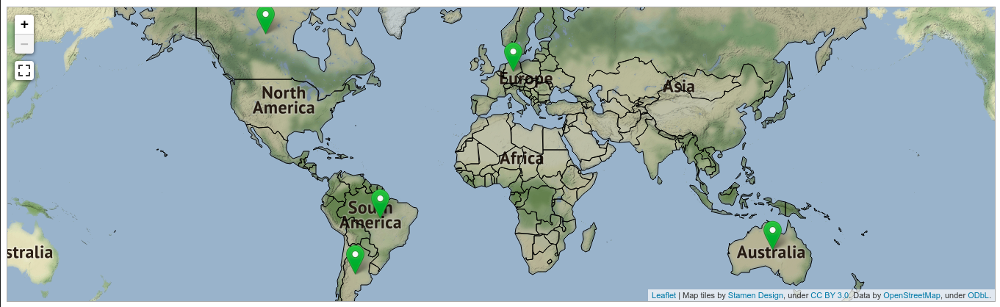
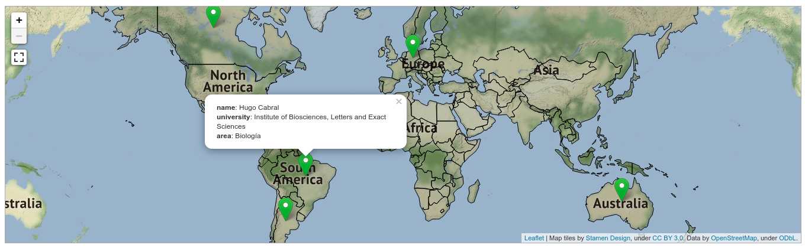
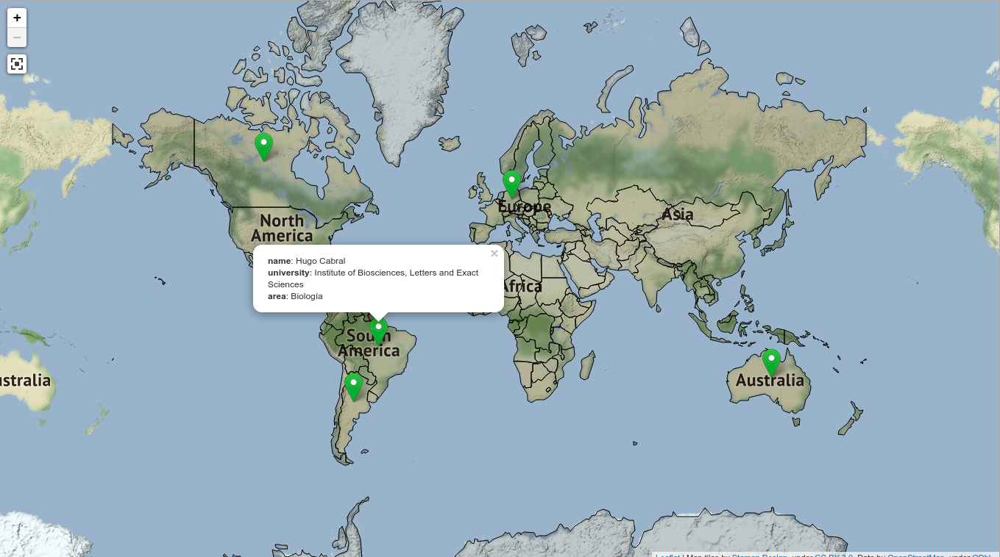

# investigadores_paraguayos
Ejemplo de Investigadores Paraguayos

## Screenshots

Levantar en sitio en cualquier server (Apache, etc.)
[Sitio de ejemplo] (https://investigadoresparaguayos.proyectosbeta.net/)

Tecnologías utilizadas:
- JavaScript (Leaflet, JQuery)
- CSS
- HTML
- Datos OSM
